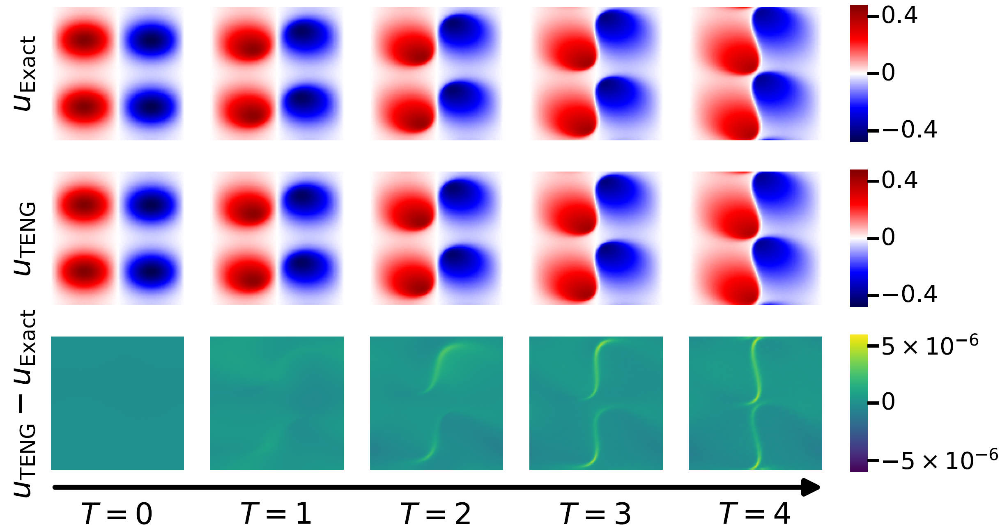

# TENG
Official Code for ICML paper TENG: Time-Evolving Natural Gradient for Solving PDEs with Deep Neural Net



```
@misc{chen2024teng,
      title={TENG: Time-Evolving Natural Gradient for Solving PDEs with Deep Neural Net}, 
      author={Zhuo Chen and Jacob McCarran and Esteban Vizcaino and Marin Soljačić and Di Luo},
      year={2024},
      eprint={2404.10771},
      archivePrefix={arXiv},
      primaryClass={cs.LG}
}
```

### License
This software is licensed under CC BY-NC-SA 4.0

You are free to:
- Share: copy and redistribute the material in any medium or format
- Adapt: remix, transform, and build upon the material

Under the following terms:
- Attribution: You must give appropriate credit, provide a link to the license, and indicate if changes were made. You may do so in any reasonable manner, but not in any way that suggests the licensor endorses you or your use.
- NonCommercial: You may not use the material for commercial purposes.
- ShareAlike: If you remix, transform, or build upon the material, you must distribute your contributions under the same license as the original.
- No additional restrictions: You may not apply legal terms or technological measures that legally restrict others from doing anything the license permits.

See [LICENSE](LICENSE) for details.
